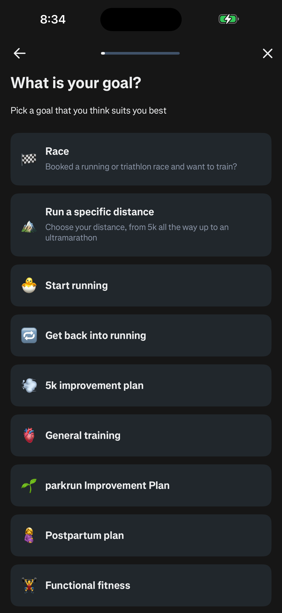
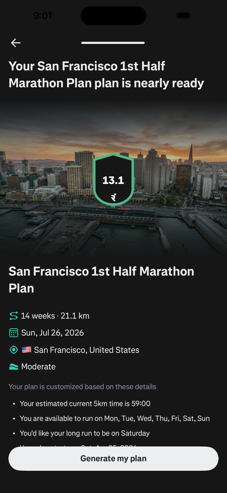
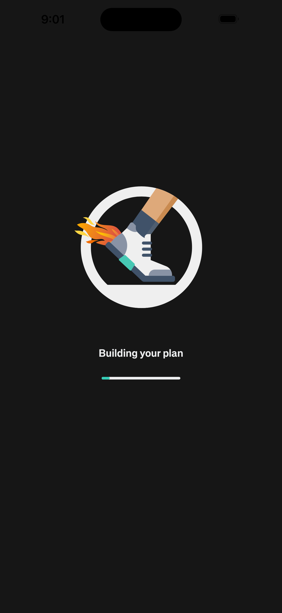
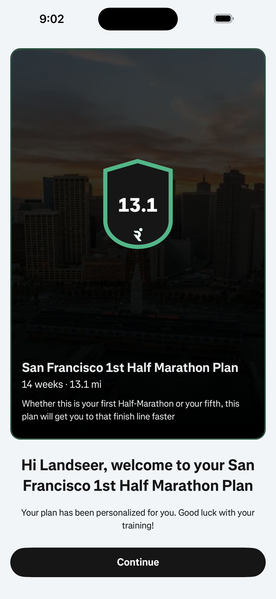
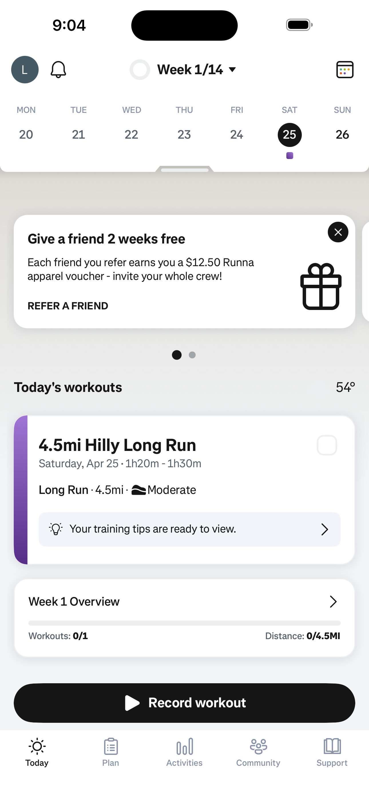
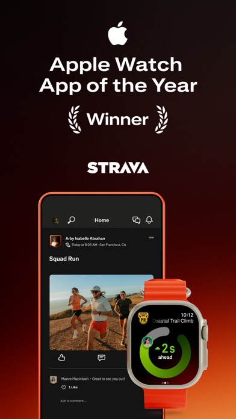
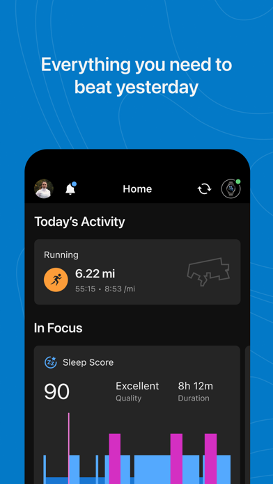
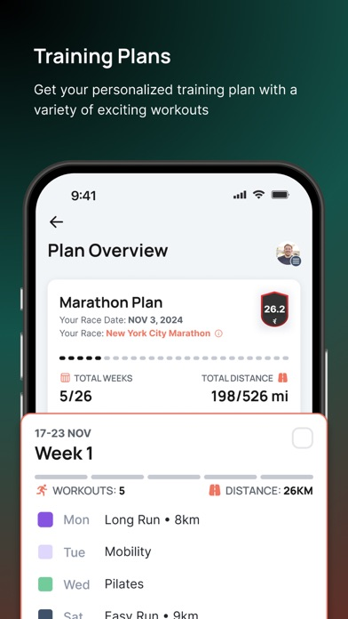

# Design Research: Tempo Premium iOS Onboarding (Plan Briefing-Led)

## TL;DR
Tempo should shift from "form onboarding" to a **performance setup -> plan briefing -> day-one activation** arc. The highest-leverage change is making `Plan Briefing` the emotional and functional center: users should see a human-readable timeline, phase model, week-1 intent, and editable controls before any permission asks.  
Use concise, athletic, non-jargony language and tighter iOS hierarchy (less card-stack, more compact metric rows + phase strips). Replace the generic tour with `Today's Briefing` so users always land with a clear first session and control levers.

## Recommendations / Next Steps
1. **Reframe onboarding as a coaching sequence, not a wizard** — Each screen should answer "what did Tempo understand?" and "what can I control next?"  
2. **Make Plan Briefing the trust moment** — Structured overview card + phase strip + Week 1 card + "Why this fits" explanation + pre-start adjustments.  
3. **Delay heavy permissions until after value** — Keep `Health Sync` post-briefing and non-blocking; explain exact data uses with user control language.  
4. **Replace Quick Tour with Today activation** — Day-one card stack should start Week 1 immediately with contextual help, not feature education.

### Recommendation 1 Mockup (Flow Arc)
```
┌──────────────────────────────────────┐
│ Welcome: "Know what to do next."    │
│ [Build my plan]                      │
└───────────────┬──────────────────────┘
                │
┌───────────────▼──────────────────────┐
│ Goal + Starting Point                │
│ short, specific inputs only          │
└───────────────┬──────────────────────┘
                │
┌───────────────▼──────────────────────┐
│ Building Plan Briefing (fast state) │
└───────────────┬──────────────────────┘
                │
┌───────────────▼──────────────────────┐
│ Plan Briefing + Adjust before start  │
└───────────────┬──────────────────────┘
                │
┌───────────────▼──────────────────────┐
│ Health Sync (optional) -> Today      │
└──────────────────────────────────────┘
```

### Recommendation 2 Mockup (Plan Briefing Core)
```
┌──────────────────────────────────────┐
│ Your plan briefing is ready          │
│ 21-week controlled build             │
│ May 25 -> Oct 17   5 days/week       │
│ Week 1 target: 4h 10m   Mode: Balance│
├──────────────────────────────────────┤
│ Base 1-6 | Build 7-14 | Peak 15-18   │
│ Taper 19-21                           │
├──────────────────────────────────────┤
│ Week 1: Set the floor                │
│ - easy aerobic - long endurance      │
│ - strength support - recovery spacing│
├──────────────────────────────────────┤
│ Why this fits                         │
│ "Long-range goal + 5 days available  │
│ + consistency priority => controlled  │
│ first block."                         │
├──────────────────────────────────────┤
│ [Start plan]  [Edit goal]            │
│ Lower intensity | Days | Constraints  │
└──────────────────────────────────────┘
```

### Recommendation 3 Mockup (Permission Framing)
```
┌──────────────────────────────────────┐
│ Make Tempo adapt automatically       │
│ Connect Apple Health (optional)      │
├──────────────────────────────────────┤
│ Workouts   Detect completed sessions │
│ Heart rate Understand effort         │
│ Sleep      Add recovery context      │
│ Steps      Read daily load           │
│ Weight     Optional trend tracking   │
├──────────────────────────────────────┤
│ [Connect Apple Health]  [Not now]    │
│ You control this in iOS Settings.    │
└──────────────────────────────────────┘
```

### Recommendation 4 Mockup (Today Activation)
```
┌──────────────────────────────────────┐
│ Today's briefing                      │
│ Week 1 starts today                   │
├──────────────────────────────────────┤
│ Today                                 │
│ Easy aerobic session  30-45 min       │
│ Why: build the floor, avoid fatigue   │
├──────────────────────────────────────┤
│ Need to adjust?                       │
│ Move workout | Lower intensity | Sore │
├──────────────────────────────────────┤
│ [Start Week 1] [Adjust today]         │
│ [Ask Tempo]                           │
└──────────────────────────────────────┘
```

## Proposed Screen-by-Screen Redesign (Required 7-Screen Flow)

### 1) Welcome
- **Headline:** `Know what to do next.`
- **Subhead:** `Tempo turns your goal, schedule, and training data into a plan that adapts around real life.`
- Replace trust block with `How Tempo starts`:
  - `01 Set your goal`
  - `02 Review your starting plan`
  - `03 Connect Apple Health for smarter adjustments`
- CTAs: `Build my plan` (primary), `Sign in` (secondary)
- Footer: `No manual logging required to begin.`
- Visual tone: clean white canvas, restrained green accents, tight vertical rhythm, athletic-not-gamified.

### 2) Goal
- **Title:** `What are you building toward?`
- **Subhead:** `Choose a direction. Add a race link or describe the goal in your own words.`
- Use 2-column responsive grid with concise labels:
  - Race / Fitness / Strength / Hybrid / Return / Not sure
- Add detail field:
  - Label: `Add detail`
  - Placeholder: `Paste a race link or describe your goal`
  - Helper: `Links, messy notes, and rough goals are fine. Tempo will clean it up.`
- `Continue` CTA remains anchored and thumb-friendly.

### 3) Starting Point
- **Title:** `Calibrate your starting point`
- **Subhead:** `A few answers help Tempo set the first week without overreaching.`
- Refined 5-step indicator (thin progress rail + explicit step label).
- Use chip groups, not stacked giant cards, for:
  - consistency, protected priority, weekly days, constraints, first block feel
- If `Injury or pain` selected: reveal optional free-text note inline.
- Default first block mode: `Balanced`.

### 4) Building Plan Briefing
- **Title:** `Building your plan briefing`
- Animated checklist (subtle timing, no loud loaders):
  - Reading your goal
  - Setting your timeline
  - Estimating weekly load
  - Creating your first block
  - Adding recovery space
  - + `Mapping race timeline` when event exists
- If health not connected: `Health data can be connected after review.`

### 5) Plan Briefing (Aha Moment)
- **Title:** `Your plan briefing is ready`
- Main briefing card:
  - Goal/event name
  - `21-week controlled build`
  - Timeline (humanized): `May 25 -> Oct 17`
  - Training days/week
  - Week 1 target
  - Start mode: `Balanced` / `Conservative` / `Performance`
- Phase strip:
  - Base: Weeks 1-6
  - Build: Weeks 7-14
  - Peak: Weeks 15-18
  - Taper: Weeks 19-21
- Week 1 card: Set the floor (swim technique / easy aerobic / strength support / long endurance / recovery spacing)
- Why this fits card: plain-language rationale tied to user inputs.
- Controls before activation:
  - Lower intensity
  - Change training days
  - Add constraint
  - Preview Week 1
- CTAs: `Start plan` + `Edit goal`.

### 6) Health Sync
- **Title:** `Make Tempo adapt automatically`
- **Subhead:** `Connect Apple Health so Tempo can understand workouts, recovery, sleep, and daily load without manual entry.`
- Permission cards:
  - Workouts / Heart rate / Sleep / Steps / Weight (optional)
- CTAs: `Connect Apple Health` + `Not now`
- Footer: `You control Health permissions in iOS Settings.`
- Non-blocking: users continue if skipped.

### 7) Today's Briefing (Replaces Quick Tour)
- **Title:** `Today's briefing`
- Hero: `Week 1 starts today.`
- Today card:
  - `Easy aerobic session`
  - `30-45 min`
  - Why: `Build the floor without adding unnecessary fatigue.`
- Adjustment card:
  - Move workout / lower intensity / report soreness
- Actions:
  - `Start Week 1`
  - `Adjust today`
  - `Ask Tempo`
- If health not connected: non-blocking prompt card to connect.

## Visual System Direction (iOS-First Premium)
- Reduce "pillowy" feel:
  - Main cards: 20-24px radius
  - Chips: 14-18px
  - Buttons: 18-20px
- Prioritize hierarchy:
  - Large title + compact metrics rows + subtle separators + phase strip
- Color discipline:
  - Green only for primary action, selected state, progress, positive status
  - Remove heavy glow and decorative gradients
- Voice:
  - confident coach, plain language, no synthetic pseudo-science terminology
- Instrumentation energy:
  - compact weekly load and consistency indicators, not dashboard noise

## Copy Rewrites for Problem Areas
- Replace `structured setup` with `Build your starting plan`
- Replace `Intensity: aggressive` with:
  - `Conservative`, `Balanced`, `Performance`
- Replace fake technical language (`workload trend, recovery signal drift...`) with:
  - `Tempo adjusts from your completed sessions, recovery patterns, and missed days.`
- Replace raw machine-like plan paragraph with short coach voice:
  - `Tempo is starting with a controlled base week because your goal is long-range, your schedule supports 5 days, and consistency matters more than intensity right now.`

## Data/Logic Model (Implementation-Ready)
- Persist onboarding state:
  - `goalType`
  - `rawGoalInput`
  - `eventUrl`
  - `eventName`
  - `eventDate`
  - `currentTrainingFrequency`
  - `weeklyAvailability`
  - `protectedPriority`
  - `constraints`
  - `injuryNotes`
  - `firstBlockMode`
  - `healthConnected`
  - `onboardingCompleted`
  - `activePlanCreated`
- Intensity mapping:
  - `conservative -> Conservative`
  - `balanced -> Balanced`
  - `aggressive -> Performance`
- Date formatting:
  - Use locale-aware medium dates (e.g., `May 25`) and compact ranges (`May 25 -> Oct 17`)
- Phase generation for long plans:
  - Base / Build / Peak / Taper calculated from total week count.

## Patterns
- Best flows make value visible before asking for permissions.
- A short "building plan" transition increases perceived intelligence when followed by clear output.
- Confidence-building copy is specific, not hype-driven.
- Post-onboarding landing should be task-first (`Today`) rather than educational walkthrough.

## Anti-Patterns
- Generic card stacks with equal visual weight.
- Abstract SaaS copy in a performance product.
- Early permission walls before seeing a plan.
- Raw system labels/dates exposed to users.
- Empty dashboard state after onboarding completion.

## Unique Angles for Tempo
- "Plan Briefing" as branded artifact users can trust and edit.
- `Week 1: Set the floor` language creates safety + momentum.
- "Adjust before you start" turns control into product differentiator.
- "Today's Briefing" replaces tour debt with immediate utility.

## Findings
- Competitive onboarding in serious training apps wins on **confidence and specificity**, not novelty visuals.
- Flows with many steps can still convert when each step clearly de-risks the athlete's concern.
- Tempo should avoid over-collecting data up front; collect what directly shapes Week 1 and defer the rest.
- Premium perception comes from restraint: sharp hierarchy, concise copy, and meaningful defaults.

## Key Examples

*Runna - Goal-specific prompt early in onboarding, making intent explicit before deep setup [Web]*


*Runna - Mid/onboarding plan summary preview validates user effort and shows near-term output [Web]*


*Runna - Transitional "building" state sets expectation of personalization without overwhelming detail [Web]*


*Runna - "Plan ready" confirmation creates a clear handoff into execution [Web]*


*Runna - Activation lands on an actionable today view, not a generic tutorial [Web]*


*Strava - Strong visual hierarchy and immediate action framing in first-run experience [Web]*


*Garmin Connect - Utility-first training framing and practical navigation to plans [Web]*


*Runna - Athletic tone and focused setup framing without heavy UI clutter [Web]*

## Sources
- https://revyl.com/atlas/runna/flows/sign-up-and-complete-onboarding/
- https://www.growthdives.com/p/how-to-nail-onboarding-a-case-study
- https://lifecyclearchitect.com/guides/onboarding-optimization-for-fitness-apps/
- https://support.strava.com/hc/en-us/articles/216917527-Health-App-and-Strava
- https://www8.garmin.com/manuals/webhelp/GUID-0221611A-992D-495E-8DED-1DD448F7A066/EN-US/GUID-A2FB338B-0E75-4149-A5EE-BA66064D2ABF.html
- https://apps.apple.com/us/app/runna-running-plans-coach/id1594204443
- https://apps.apple.com/us/app/strava-run-bike-walk/id426826309
- https://apps.apple.com/us/app/garmin-connect/id583446403

## Research Constraints
Lazyweb MCP was not connected in this workspace during execution, so this report uses web-accessible references and captured public screenshots only.
